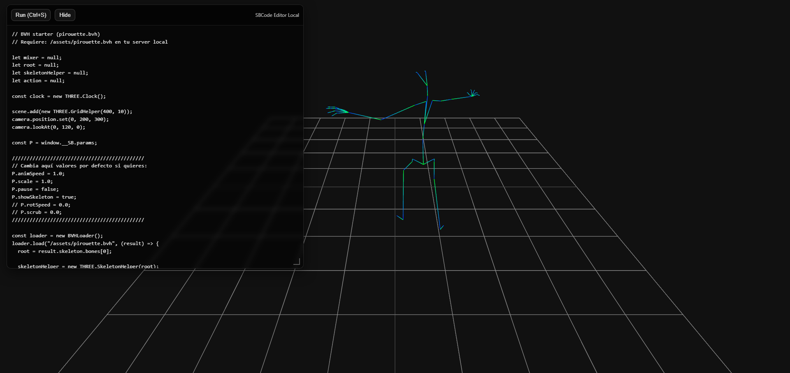
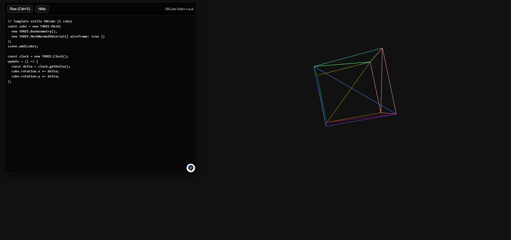

# SBCode Editor
Local Three.js editor inspired by SBCode, designed for quick prototyping and animation testing.

This project provides a lightweight live coding environment where the Three.js scene runs in the background and the code editor floats on top. 

You can modify and execute code instantly, load and visualize ```.bvh``` motion capture files or use normal Three.js code to render shapes and animations.

## Instalation
```bash
git clone https://github.com/aristu138167/Threejs-Boilerplate.git
cd Threejs-Boilerplate
git checkout sbcode
npm install
npm start
```
Then visit http://127.0.0.1:3000


## BVH Animation Support 


Inside the ```\assets``` folder you will find several ```.bvh``` motion capture files. You can add as many ```.bvh``` files as you want to the assets folder and load them to test
These can be:

- Loaded directly into the editor

- Visualized as animated skeletons

- Modified through code

- Experimented with in real time


# Standard Three.js Usage

In addition to BVH animations, the editor fully supports normal Three.js workflows.

You can:

- Create custom geometries

- Add lights, cameras and controls

- Render meshes

- Use materials

Example:
```js
const cube = new THREE.Mesh(
  new THREE.BoxGeometry(),
  new THREE.MeshNormalMaterial({ wireframe: true })
);

scene.add(cube);

const clock = new THREE.Clock();

update = () => {
  const delta = clock.getDelta();
  cube.rotation.x += delta;
  cube.rotation.y += delta;
};
```